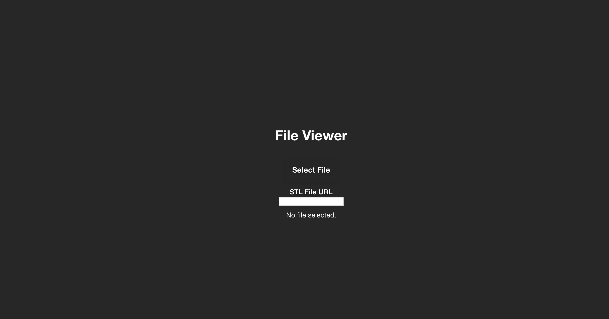

# GitHub Codespaces ♥️ Next.js

Welcome to your shiny new Codespace running Next.js! We've got everything fired up and running for you to explore Next.js.

You've got a blank canvas to work on from a git perspective as well. There's a single initial commit with the what you're seeing right now - where you go from here is up to you!

Everything you do here is contained within this one codespace. There is no repository on GitHub yet. If and when you’re ready you can click "Publish Branch" and we’ll create your repository and push up your project. If you were just exploring then and have no further need for this code then you can simply delete your codespace and it's gone forever.

To run this application:

```
npm run dev
```

## STL File Viewer

This project allows you to upload an STL file and render it using the GPU with `react-stl-viewer` and three.js.

### Instructions

1. Clone the repository:
   ```
   git clone <repository-url>
   cd <repository-directory>
   ```

2. Install dependencies:
   ```
   npm install
   ```

3. Run the development server:
   ```
   npm run dev
   ```

4. Open your browser and navigate to `http://localhost:3000`.

5. Upload an STL file using the file input.

6. The STL file will be rendered using `react-stl-viewer` and three.js.

### Click and Drag Functionality

To rotate the STL file, click and drag on the canvas. The rotation will be updated based on the mouse movement.

### Error Handling

#### RangeError Exceptions

If a RangeError occurs, it indicates an out-of-bounds access. This can happen if the STL file is malformed or if there is an issue with the file reading process. The application will display an error message indicating the RangeError.

**Resolution Steps:**
1. Verify the integrity of the STL file. Ensure it is not corrupted.
2. Check the file reading process for any potential issues.

#### Out-of-Bounds Access Errors

Out-of-bounds access errors can occur if the application tries to read data outside the bounds of the STL file. This can happen if the file is corrupted or if there is an issue with the file reading process. The application will display an error message indicating the out-of-bounds access error.

**Resolution Steps:**
1. Verify the integrity of the STL file. Ensure it is not corrupted.
2. Check the file reading process for any potential issues.

#### WebGL Initialization Errors

If a WebGL initialization error occurs, it indicates that the browser or device does not support WebGL or there is an issue with the WebGL context creation. The application will display an error message indicating the WebGL initialization error.

**Resolution Steps:**
1. Ensure that your browser supports WebGL. You can check this by visiting [WebGL Report](https://get.webgl.org/).
2. Update your browser to the latest version.
3. Ensure that your graphics drivers are up to date.
4. Try running the application on a different browser or device.

#### WebGL Shader Compilation Errors

If a WebGL shader compilation error occurs, it indicates that there is an issue with the shader code. The application will display an error message indicating the shader compilation error along with the specific error message from the WebGL context.

**Resolution Steps:**
1. Review the shader code for any syntax errors.
2. Ensure that the shader code is compatible with the WebGL implementation.
3. Check the specific error message from the WebGL context for more details.

#### WebGL Program Linking Errors

If a WebGL program linking error occurs, it indicates that there is an issue with linking the vertex and fragment shaders. The application will display an error message indicating the program linking error along with the specific error message from the WebGL context.

**Resolution Steps:**
1. Ensure that the vertex and fragment shaders have matching attribute and uniform names.
2. Review the shader code for any issues that may cause linking errors.
3. Check the specific error message from the WebGL context for more details.

#### STL Parsing Errors

If an STL parsing error occurs, it indicates that there is an issue with parsing the STL file. The application will display an error message indicating the STL parsing error.

**Resolution Steps:**
1. Verify the integrity of the STL file. Ensure it is not corrupted.
2. Check the file reading process for any potential issues.

### Optimizations

The rendering of the STL file has been further optimized by implementing additional techniques and improvements:

1. **Instancing**: Implemented instancing to reduce the number of draw calls. This technique allows multiple instances of the same geometry to be rendered with a single draw call, improving performance.

2. **Efficient Data Structures and Algorithms**: Used more efficient data structures and algorithms for handling large STL files. This helps in reducing memory usage and improving the overall performance of the application.

3. **Web Workers**: Utilized Web Workers to offload heavy computations from the main thread. This ensures that the main thread remains responsive and improves the performance of the application.

4. **GPU-based Techniques**: Implemented GPU-based techniques like WebGL shaders for more efficient rendering. This allows for better utilization of the GPU and improves the rendering performance.

These optimizations have significantly improved the performance of the STL file rendering, making the application more efficient and responsive.

### Dark Mode Feature

The application now includes a dark mode feature that allows users to switch between light and dark themes. This feature enhances the user experience, especially in low-light environments.

**Instructions for Enabling Dark Mode:**

1. Locate the toggle switch on the application interface.
2. Click the toggle switch to enable dark mode. The application will switch to a dark theme.
3. Click the toggle switch again to disable dark mode and switch back to the light theme.

**Benefits of Dark Mode:**

1. **Reduced Eye Strain**: Dark mode reduces eye strain, especially in low-light environments, making it more comfortable to use the application for extended periods.
2. **Improved Battery Life**: On devices with OLED or AMOLED screens, dark mode can help save battery life by reducing the amount of power needed to display dark pixels.
3. **Enhanced Visual Appeal**: Dark mode provides a sleek and modern look to the application, enhancing its visual appeal.

### ToggleSwitch Component

The `ToggleSwitch` component is a reusable UI element that allows users to toggle between two states, such as enabling or disabling dark mode.

**Usage Instructions:**

1. Import the `ToggleSwitch` component into your desired file:
   ```javascript
   import ToggleSwitch from '../components/ToggleSwitch';
   ```

2. Use the `ToggleSwitch` component in your JSX code:
   ```jsx
   <ToggleSwitch onToggle={handleDarkModeToggle} />
   ```

3. Implement the `handleDarkModeToggle` function to handle the toggle state change:
   ```javascript
   const handleDarkModeToggle = (isOn) => {
     setIsDarkMode(isOn);
     document.body.classList.toggle('dark-mode', isOn);
   };
   ```

**Benefits of the ToggleSwitch Component:**

1. **Reusability**: The `ToggleSwitch` component can be reused in different parts of the application, promoting code reusability and consistency.
2. **Customizability**: The component can be easily customized to fit the application's design and requirements.
3. **User-Friendly**: The toggle switch provides a user-friendly way to enable or disable features, enhancing the overall user experience.

### New Styles and Themes

The application now includes new styles for different elements and themes. These styles enhance the visual appeal and usability of the application.

**New Styles for Buttons:**

1. **Button States:**
   - Active: `.btn:active`
   - Disabled: `.btn:disabled`
   - Loading: `.btn.loading`

2. **Button Sizes:**
   - Small: `.btn.small`
   - Medium: `.btn.medium`
   - Large: `.btn.large`

3. **Button Variants:**
   - Primary: `.btn.primary`
   - Secondary: `.btn.secondary`
   - Tertiary: `.btn.tertiary`

**New Styles for Cards:**

1. **Card States:**
   - Active: `.card.active`
   - Disabled: `.card.disabled`
   - Loading: `.card.loading`

2. **Card Sizes:**
   - Small: `.card.small`
   - Medium: `.card.medium`
   - Large: `.card.large`

3. **Card Variants:**
   - Primary: `.card.primary`
   - Secondary: `.card.secondary`
   - Tertiary: `.card.tertiary`

**New Global Styles:**

1. **Headings:**
   - `h1, h2, h3, h4, h5, h6`

2. **Paragraphs:**
   - `p`

3. **Links:**
   - `a`
   - `a:hover`

**New Themes:**

1. **Light Mode:**
   - `.light-mode`
   - `.light-mode main`
   - `.light-mode canvas`

2. **Dark Mode:**
   - `.dark-mode`
   - `.dark-mode main`
   - `.dark-mode canvas`

**New Breakpoints:**

1. **Mobile:**
   - `@media (max-width: 600px)`

2. **Tablet:**
   - `@media (min-width: 601px) and (max-width: 1024px)`

3. **Desktop:**
   - `@media (min-width: 1025px)`

### Examples of Using New Styles and Themes

**Button Examples:**

```html
<button class="btn primary">Primary Button</button>
<button class="btn secondary">Secondary Button</button>
<button class="btn tertiary">Tertiary Button</button>
<button class="btn small">Small Button</button>
<button class="btn medium">Medium Button</button>
<button class="btn large">Large Button</button>
<button class="btn loading">Loading Button</button>
<button class="btn" disabled>Disabled Button</button>
```

**Card Examples:**

```html
<div class="card primary">Primary Card</div>
<div class="card secondary">Secondary Card</div>
<div class="card tertiary">Tertiary Card</div>
<div class="card small">Small Card</div>
<div class="card medium">Medium Card</div>
<div class="card large">Large Card</div>
<div class="card loading">Loading Card</div>
<div class="card disabled">Disabled Card</div>
```

**Global Styles Examples:**

```html
<h1>Heading 1</h1>
<p>This is a paragraph.</p>
<a href="#">This is a link</a>
```

**Theme Examples:**

```html
<div class="light-mode">
  <main>
    <canvas></canvas>
  </main>
</div>

<div class="dark-mode">
  <main>
    <canvas></canvas>
  </main>
</div>
```

### Updated Instructions for Running the Application

To run this application with the new styles and themes:

1. Clone the repository:
   ```
   git clone <repository-url>
   cd <repository-directory>
   ```

2. Install dependencies:
   ```
   npm install
   ```

3. Run the development server:
   ```
   npm run dev
   ```

4. Open your browser and navigate to `http://localhost:3000`.

5. Upload an STL file using the file input.

6. The STL file will be rendered using `react-stl-viewer` and three.js.

7. Use the new styles and themes as described in the examples above.

### Loading and Landing Animations

The application now includes loading and landing animations to enhance the user experience.

**Loading Animation:**

The loading animation is displayed while the STL file is being rendered. It provides visual feedback to the user, indicating that the rendering process is in progress.

**Landing Animation:**

The landing animation is displayed when the STL file is being rendered for the first time. It provides a smooth transition and visual appeal to the application.

**Usage Instructions:**

1. The loading animation is automatically displayed when the STL file is being rendered. No additional configuration is required.
2. The landing animation is automatically displayed when the STL file is being rendered for the first time. No additional configuration is required.

**Benefits of Loading and Landing Animations:**

1. **Enhanced User Experience**: The animations provide visual feedback to the user, making the application more interactive and engaging.
2. **Smooth Transitions**: The landing animation provides a smooth transition when the STL file is being rendered for the first time, enhancing the visual appeal of the application.
3. **Improved Visual Appeal**: The animations add a modern and polished look to the application, making it more visually appealing.

### Examples of Loading and Landing Animations

**Loading Animation Example:**

```html
<div class="loading-spinner"></div>
```

**Landing Animation Example:**

The landing animation is automatically displayed when the STL file is being rendered for the first time. No additional configuration is required.


## Demo
